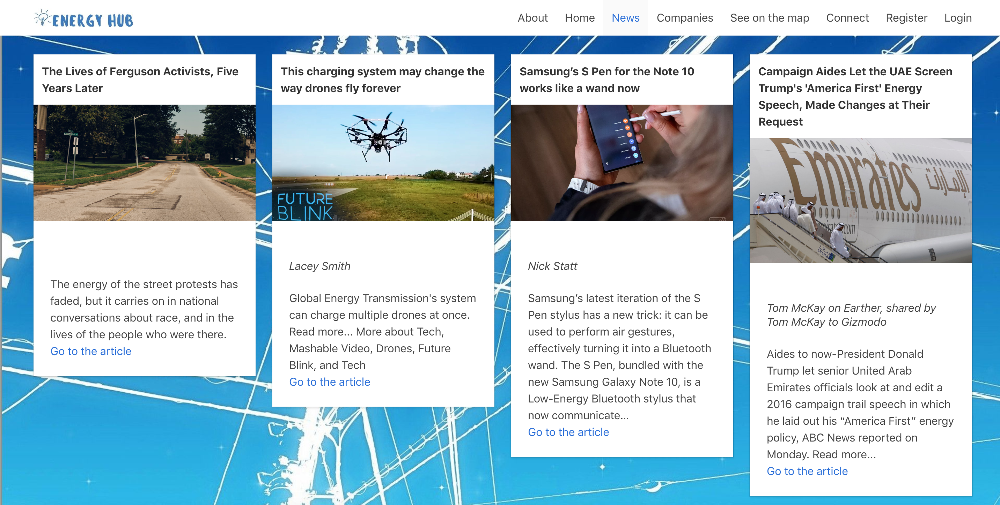
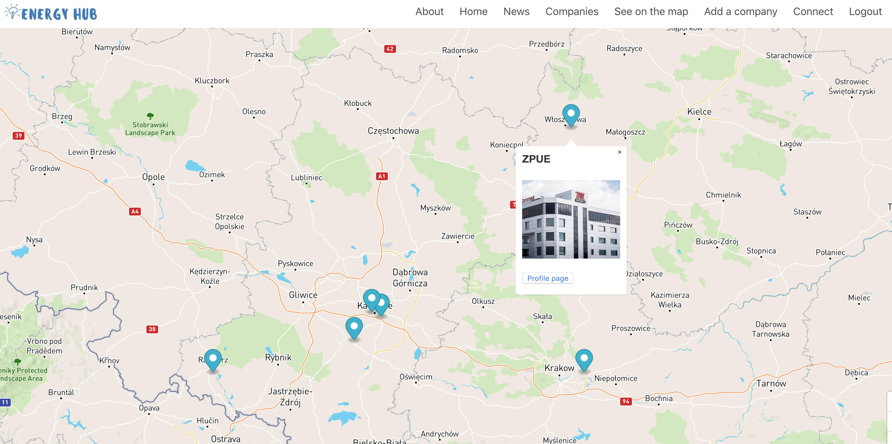
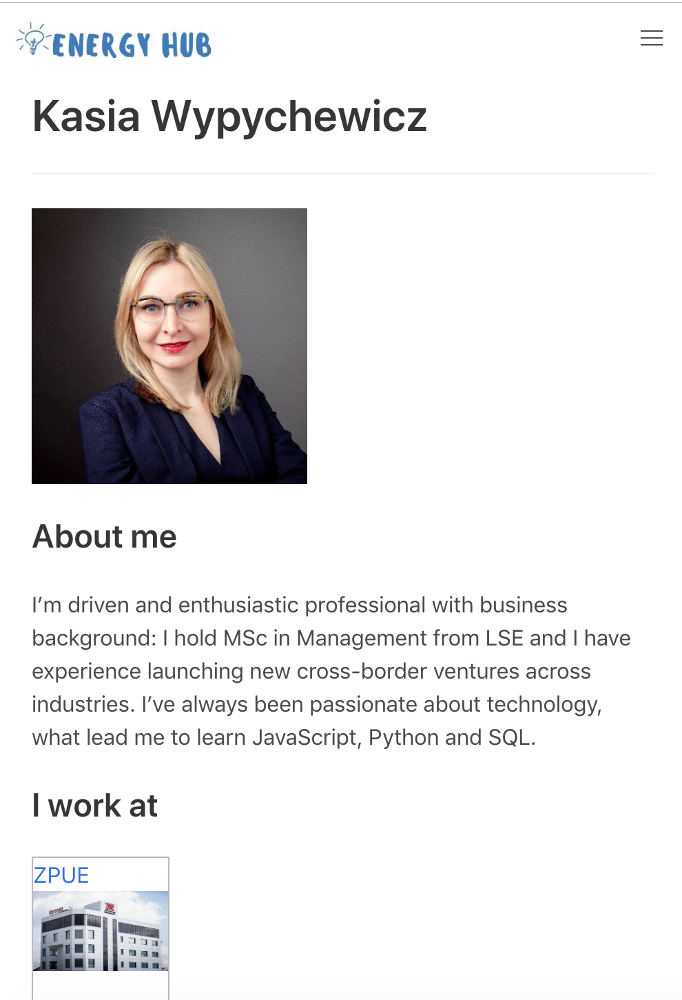
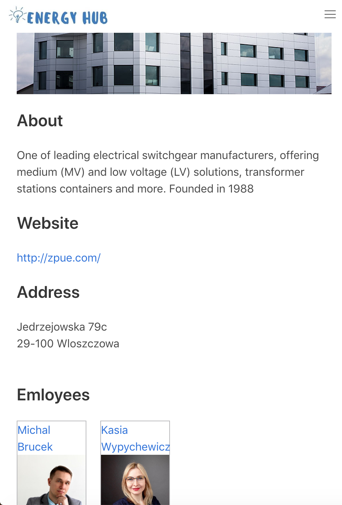
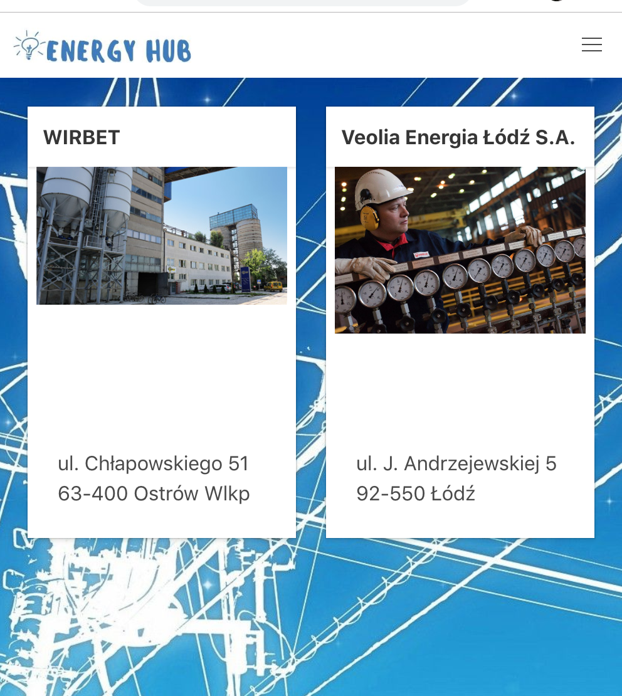

​
# General Assembly – Project 4
This was the second project during the General Assembly Software Engineering Immersive course (Week 12).

## Brief
* Build a full-stack application.
* Use a Python Flask API to serve your data from a Postgres database.
* Consume your API with a separate front-end built with React.
* [CRUD](https://en.wikipedia.org/wiki/Create,_read,_update_and_delete)
* Application must be deployed online.
​
## Timeframe & Team
​
1 week, solo
​
## Built With
* PostgreSQL
* Python
* Insomnia
* React
* Axios
* Webpack
* HTML5
* CSS
* Bulma
* Heroku

## Deployment
​
This website is deployed on Heroku and it can be found here: https://powerengineering.herokuapp.com/

## Development

The main Python framework I used was Python-Flask, with SQLAlchemy and Blueprint.

Flask Marshmallow library changed models into JSON strings. Marshmallow could then be used for validating schemas and formatting data such as timestamps.

Once the database was functional, I created models (users, companies, posts comments) and routes. Once the CRUD routes were working with requests in Insomnia, I moved onto creating the frontend of the application using React.


## Concept

It is a hub for Engineering Industry in Poland. It has features similar to LinkedIn where login users can create profiles to connect with each other and with companies.

Thanks to newsapi.org public API this website can provide newest sector related information.

## Visuals

**Landing page**


**Page using news public API to show sector related information**


**Login page**


**Map with markers showing companies locations**


**Responsive design: companies list, company profile, user profile**




## Code - backend

**Company model**
```
class Company(db.Model, BaseModel):

    __tablename__ = 'companies'

    id = db.Column(db.Integer, primary_key=True)
    name = db.Column(db.String(100), nullable=False, unique=True)
    city = db.Column(db.String(300), nullable=False)
    street = db.Column(db.String(300), nullable=False)
    number = db.Column(db.String(300), nullable=False)
    postcode = db.Column(db.String(300), nullable=False)
    website = db.Column(db.String(300))
    image = db.Column(db.String(600))
    profile = db.Column(db.String(900))
    lat = db.Column(db.Float)
    long = db.Column(db.Float)
    employees = db.relationship('User', secondary=users_companies, backref='companies')


class CompanySchema(ma.ModelSchema, BaseSchema):
    class Meta:
        model = Company

    comments = fields.Nested('CommentSchema', many=True)
    employees = fields.Nested('UserSchema', many=True, only=('name', 'id', 'image'))

```

**Adding a new company route**
```
@api.route('/companies', methods=['POST'])
@secure_route
def create():
    data = request.get_json()
    company, errors = company_schema.load(data)
    if errors:
        return jsonify(errors), 422
    company.save()
    return company_schema.jsonify(company), 201
```

## Code - frontend

**registering a new user**
```
class Register extends React.Component {
  constructor() {
    super()

    this.state ={ data: {}, errors: {} }

    this.handleChange = this.handleChange.bind(this)
    this.handleSubmit = this.handleSubmit.bind(this)
  }

  handleChange({ target: { name, value }}) {
    const data = { ...this.state.data, [name]: value }
    const errors = {...this.state.errors, [name]: ''}
    this.setState({ data, errors })
  }

  handleSubmit(e) {
    e.preventDefault()

    axios.post('/api/register', this.state.data)
      .then(() => this.props.history.push('/api/login'))
      .catch(err => this.setState({ errors: err.response.data.errors }))
  }
```  

**Adding comments on a company page**
```
handleSubmit(e) {
  e.preventDefault()

  axios.post(`/api/companies/${this.props.match.params.id}/comments`, this.state.comment, {
    headers: { 'Authorization': `${Auth.getToken()}` }
  })
    .then(() => this.getData())
    .catch(err => console.log(err))
}
```

## Challenges

It was challenging to do the whole full-stack project myself in only one week, but also allowed me to get to know all parts of the process.  

I used Mapbox to show the locations of all companies listed on the website. As Mapbox doesn’t use addresses, but only geographical coordinates I added latitude and longitude for all companies while creating a seed file. It wouldn’t be user friendly to  ask our users to do the same when adding their companies, so I used mapbox function which allows to convert new addresses into geographic coordinates.

## Future improvements

Next stage of developing this website would be adding private messages functionality.

Improving graphics.

## Key learnings
Building a functioning full-stack app where requests can successfully display information on the front end (read) and data can be created/updated/deleted on the back end
